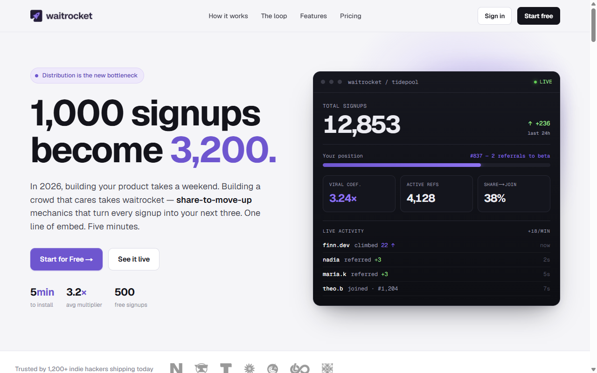

<div align="center">

# Waitrocket

**Viral waitlists for launch day — drop one script tag, let referrals do the rest**

[waitrocket.com](https://waitrocket.com)&nbsp;&nbsp;·&nbsp;&nbsp;[](https://waitrocket.com)&nbsp;&nbsp;[](#)&nbsp;&nbsp;[](#)

</div>

---

## The problem

A waitlist that only collects emails is a dead list. The ones that explode reward people for sharing — but building referral tracking, live queue positions, and anti-fraud is weeks of work nobody wants right before launch.

## What Waitrocket does

One script tag turns any landing page into a viral, referral-driven waitlist.

```html
<script src="https://waitrocket.com/v1.js" data-slug="your-waitlist"></script>
```

```
join → get a position → share referral link → jump the queue → repeat
```

Every referral moves you up. You watch it grow in a real-time dashboard.

```
currentPosition = max(1, basePosition − referrals × weight)
```

> 100 signups become 1,000.

---

## Screens

<div align="center">

</div>

---

## Roadmap

- [x] Embeddable SDK (`v1.js`) — one script tag, zero dependencies
- [x] Referral-chain queue engine — position moves with each referral
- [x] Real-time owner dashboard + CSV export
- [x] Paddle billing + webhook-synced Pro (removes the "Powered by" badge)
- [x] Disposable / temp-mail blocking at signup
- [ ] Public top-referrer leaderboard
- [ ] Webhooks & platform integrations

## How it's built

`v1.js` is a **self-contained widget** — no framework, no dependencies. It injects the signup form, shows the live position and referral link after signup, and persists the signup in `localStorage` so returning visitors see their place.

Queue position is derived from the referral chain: each referral subtracts a configurable weight from your base position. Owner auth is Clerk, data is Neon + Prisma, Paddle webhooks drive entitlements, and Resend sends confirmation / position-update emails.

## Stack

Next.js · Clerk · Neon · Paddle · Resend · Vercel

---

<div align="center">

*Try it live →* [waitrocket.com](https://waitrocket.com)

</div>
